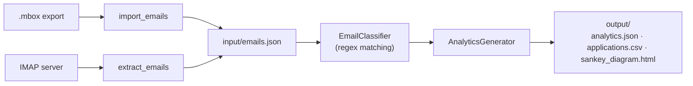

# sisifus-analytics

Parses your job-application emails, classifies each one into an application status with keyword/regex matching (no LLM), and produces analytics plus an interactive Sankey diagram of your job-search funnel. Emails are imported from Google Takeout `.mbox` exports or fetched over IMAP, and all processing happens locally.

[](https://github.com/fabricioguidine/sisifus-analytics/actions/workflows/ci.yml) [](https://www.python.org/) [](LICENSE)

## Features

- **Two email sources**: import exported `.mbox` files (Google Takeout) or fetch job-related emails over IMAP.
- **Keyword-based classification**: compiled regex patterns map each email to an application status; no LLM and no external API calls.
- **Job-related filtering**: newsletters, promotions, receipts, and similar noise are detected and excluded from the stats.
- **Company extraction**: derives a company name from the sender's display name or domain.
- **Analytics**: aggregates counts by status and company, tracks the date range, and computes a confidence-based accuracy metric.
- **Sankey visualization**: renders an interactive HTML diagram of the funnel (applied -> interviews -> offer/rejected/withdrew/ghosted).
- **Date filtering**: limit processing to a specific year and/or the last N months.

## Requirements

- Python 3.10+
- For IMAP fetching: an email account with an app-specific password (e.g. Gmail App Password).

## Installation

```bash
pip install -e .
```

For development (tests, linters, type checking):

```bash
pip install -e ".[dev]"
```

## Usage

The workflow is two steps: get emails into `input/emails.json`, then process them.

### Import from a `.mbox` export

Place your Google Takeout `.mbox` file(s) in the `input/` folder and run auto-detection:

```bash
python -m src.import_emails
```

Or point at a specific file:

```bash
python -m src.import_emails path/to/All mail.mbox
```

### Fetch over IMAP

Copy `env.template` to `.env` and fill in your credentials, then:

```bash
python -m src.extract_emails           # fetch and save to input/emails.json
python -m src.main                     # fetch from server and process in one run
```

### Process and generate analytics

```bash
python -m src.main --use-input
```

Date-filter the run:

```bash
python -m src.main --use-input --year 2025
python -m src.main --use-input --months 6
```

## Configuration

IMAP credentials and provider settings come from a `.env` file (see `env.template`). Never commit `.env`.

| Variable | Default | Purpose |
| --- | --- | --- |
| `EMAIL_ADDRESS` | (empty) | Account to fetch from |
| `EMAIL_PASSWORD` | (empty) | App-specific password |
| `EMAIL_PROVIDER` | `gmail` | Provider label |
| `IMAP_SERVER` | `imap.gmail.com` | IMAP host |
| `IMAP_PORT` | `993` | IMAP SSL port |

## Output

Processing writes to the `output/` folder:

- `analytics.json` — summary counts, status/company breakdown, per-application records.
- `applications.csv` — one row per classified email (company, status, date, subject, confidence).
- `sankey_diagram.html` — interactive funnel diagram.

## Pipeline



## Status categories

Each email is classified as one of: `applied`, `confirmation`, `interview_1`..`interview_5`, `offer`, `accepted`, `rejected`, `withdrew`, `no_reply`, or `not_job_related`. Classification is keyword-driven and approximate; the accuracy metric is the share of job-related emails matched with confidence above 0.5.

## Project structure

```
src/
  config.py          Paths and env-based configuration
  email_importer.py  Parse .mbox files (Google Takeout)
  import_emails.py   CLI: import .mbox into input/emails.json
  email_parser.py    IMAP fetch and body extraction
  extract_emails.py  CLI: fetch over IMAP into input/emails.json
  email_storage.py   Load/save emails.json with date filtering
  classifier.py      Regex-based status classification
  analytics.py       Aggregation and Sankey generation
  main.py            CLI entry point (fetch/process)
tests/               pytest suite
```

## Testing

```bash
pytest
```

## License

MIT — see [LICENSE](LICENSE).
