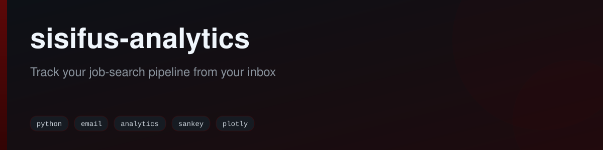
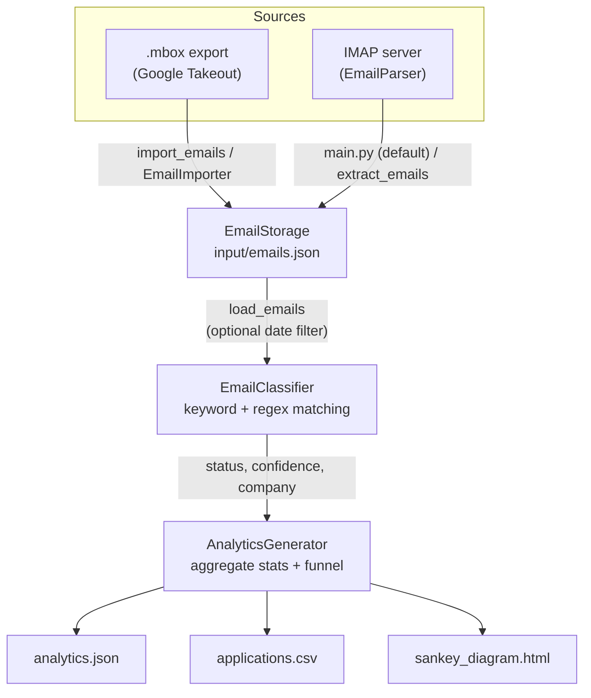

<div align="center">



[](https://github.com/fabricioguidine/sisifus-analytics/actions/workflows/ci.yml)
[](https://codecov.io/gh/fabricioguidine/sisifus-analytics)
[](https://www.python.org/)
[](LICENSE)
[](https://github.com/astral-sh/ruff)
[](https://mypy-lang.org/)
[](https://github.com/pre-commit/pre-commit)

</div>

> Track your job-search pipeline straight from your inbox.

sisifus-analytics ingests your job-application emails, classifies each one into an application status using keyword/regex matching (no LLM), and produces analytics plus an interactive Sankey diagram of your job-search funnel. Emails can be imported from Google Takeout `.mbox` exports or fetched directly over IMAP, and all processing happens locally.

## Table of Contents

- [Features](#features)
- [Architecture](#architecture)
- [Requirements](#requirements)
- [Installation](#installation)
- [Usage](#usage)
  - [Importing emails](#importing-emails)
  - [Processing emails](#processing-emails)
  - [Date filtering](#date-filtering)
- [Output](#output)
- [Classification logic](#classification-logic)
- [Status categories](#status-categories)
- [Project structure](#project-structure)
- [Testing](#testing)
- [Limitations](#limitations)
- [License](#license)

## Features

- **Two email sources**: import from exported `.mbox` files (Google Takeout) or fetch job-related emails directly over IMAP.
- **Keyword-based classification**: regex pattern matching (no LLM, no external API calls) maps each email to an application status.
- **Job-related filtering**: newsletters, promotions, receipts, and other noise are detected and excluded from the stats.
- **Company extraction**: derives a company name from the sender address or domain.
- **Analytics**: aggregates counts by status and company, tracks the date range, and computes a confidence-based accuracy metric.
- **Sankey visualization**: renders an interactive HTML diagram of the application funnel (applied -> interviews -> offer/rejected/withdrew/ghosted).
- **Date filtering**: limit processing to a specific year and/or the last N months.
- **Batch processing**: classifies in batches of 1,000 with compiled regex and truncated body scanning for speed.

## Architecture



The pipeline is modular: ingestion (`email_importer`, `email_parser`), persistence (`email_storage`), classification (`classifier`), and analytics/visualization (`analytics`) are independent units coordinated by `main.py`.

## Requirements

- Python >= 3.10
- Runtime dependencies (installed automatically): `tqdm`, `plotly`, `pandas`, `python-dotenv`, `beautifulsoup4`, `lxml`, `python-dateutil`
- For the IMAP fetch path only: a `.env` file with email credentials (an app-specific password is required for Gmail). The `.mbox` import path needs no credentials.

## Installation

```powershell
git clone https://github.com/fabricioguidine/sisifus-analytics.git
cd sisifus-analytics

# Runtime dependencies
pip install -r requirements.txt

# Or install the package (adds the dev/notebooks extras)
pip install -e ".[dev]"
```

To use the IMAP fetch path, copy the credentials template and fill it in:

```powershell
Copy-Item env.template .env
# Edit .env: EMAIL_ADDRESS, EMAIL_PASSWORD (app-specific), IMAP_SERVER, IMAP_PORT
```

## Usage

### Importing emails

Export your mail from [Google Takeout](https://takeout.google.com/) in **mbox** format, then import it. The importer recursively scans `input/` (including nested Takeout folders) for `.mbox` files.

```powershell
# Auto-detect .mbox files placed in the input/ folder
python -m src.import_emails

# Import a specific .mbox file
python -m src.import_emails "input/All mail Including Spam and Trash.mbox"

# Write to a custom storage filename (default: emails.json)
python -m src.import_emails --output emails.json
```

Alternatively, fetch job-related emails directly from an IMAP server (requires `.env`):

```powershell
# Fetch and save to input/emails.json, then process
python -m src.main

# Fetch and save only, do not process
python -m src.main --extract-only

# Standalone extraction with an optional cap and append mode
python -m src.extract_emails --limit 5000
python -m src.extract_emails --append
```

### Processing emails

```powershell
# Classify and analyze emails already stored in input/emails.json
python -m src.main --use-input
```

This loads `input/emails.json`, classifies each email (with a progress bar), generates analytics and the Sankey diagram, prints a summary, and writes results to `output/`.

### Date filtering

```powershell
# Only emails from the last 6 months
python -m src.main --use-input --months 6

# Only emails from a specific year
python -m src.main --use-input --year 2025

# Both filters combined
python -m src.main --use-input --year 2025 --months 6
```

`--use-input` and `--extract-only` are mutually exclusive. When no date flags are given and `input/emails.json` is larger than 50 MB, the tool interactively offers date-filter options.

## Output

All artifacts are written to `output/`:

| File | Description |
|------|-------------|
| `analytics.json` | Full analytics: status breakdown, per-company details, date range, accuracy, and every classified application record. |
| `applications.csv` | Tabular records with columns `company`, `status`, `date`, `subject`, `confidence`. |
| `sankey_diagram.html` | Interactive Plotly Sankey diagram of the application funnel; open in any browser. |

The console also prints a summary with totals for rejected, offers, accepted, interviews, withdrew, no-reply, not-job-related, distinct companies, and classification accuracy.

## Classification logic

Classification runs in two stages, entirely with compiled regex patterns.

1. **Job-related filtering** (`is_job_related`): emails are matched against job keywords (job, application, interview, recruiter, hiring, position, candidate, opportunity, plus Portuguese terms like vaga/emprego) and known job-platform senders (LinkedIn, Indeed, Greenhouse, Lever, Workday, etc.). Strong noise signals (newsletter, unsubscribe, promo, receipt, shipping, password reset, ...) exclude an email when no job keyword is present. Non-job emails become `not_job_related`.
2. **Status classification** (`classify_email`): the subject, sender, and first 5,000 characters of the body are scanned. Each status accumulates a confidence score from the number of matching patterns (boosted when matched in the subject). Priority rules resolve conflicts: `rejected` > `accepted` > `offer` > `withdrew` > interview stages (highest first) > `confirmation` > `applied`, defaulting to `no_reply` for job-related emails that match nothing specific.

Accuracy is reported as the share of job-related emails classified with confidence > 0.5.

## Status categories

| Status | Meaning |
|--------|---------|
| `applied` | Initial application sent or a job opportunity received. |
| `confirmation` | Receipt/confirmation of an application. |
| `interview_1` ... `interview_5` | Interview rounds, numbered. |
| `offer` | Job offer received. |
| `accepted` | Offer accepted. |
| `rejected` | Rejected by the company. |
| `withdrew` | Withdrawn or declined by you. |
| `no_reply` | Job-related but no clear outcome. |
| `not_job_related` | Excluded from application statistics. |

In the Sankey diagram these are consolidated for clarity: all rejections collapse into a single **Rejected** node, all withdrawals into **Withdrew**, and emails with no progress (no-reply, or stalled after an interview) into **Ghosted**. Missing intermediate interview stages are inferred from higher stages.

## Project structure

```
sisifus-analytics/
├── src/
│   ├── config.py          # Paths, env-based email/IMAP settings, output file locations
│   ├── email_parser.py    # IMAP fetch (SSL), header decoding, HTML-to-text body extraction
│   ├── email_importer.py  # Parse .mbox files (Google Takeout), recursive auto-import
│   ├── email_storage.py   # Save/load/merge emails to input/emails.json with date filtering
│   ├── extract_emails.py  # CLI: fetch from IMAP server and save
│   ├── import_emails.py    # CLI: import from .mbox files
│   ├── classifier.py      # Keyword/regex classification + company extraction
│   ├── analytics.py       # Stats, accuracy, Sankey diagram, JSON/CSV/HTML output
│   └── main.py            # Orchestrator CLI (--use-input, --extract-only, --months, --year)
├── tests/                 # pytest suite for classifier and analytics
├── .github/workflows/ci.yml  # Lint (ruff + mypy), test matrix (3.10–3.12), build
├── pyproject.toml         # Project metadata, ruff/mypy/pytest/coverage config
├── requirements.txt       # Runtime dependencies
└── env.template           # IMAP credentials template
```

## Testing

```powershell
pytest
```

The suite (`tests/test_classifier.py`, `tests/test_analytics.py`) covers per-status classification, priority rules, job-related filtering, company extraction, confidence scoring, batch processing, and analytics aggregation. CI runs ruff, ruff-format, mypy, and pytest with coverage across Python 3.10–3.12.

## Limitations

- Keyword/regex classification typically lands around 70–90% accuracy and can misread unusual wording, sarcasm, or non-standard formats.
- English and Portuguese keywords are supported; other languages may classify poorly.
- Company extraction relies on sender domains/names; generic providers (gmail, outlook, ...) yield `Unknown`, and third-party recruiters may mask the real employer.
- Only `.mbox` is supported for file import; malformed messages are skipped.
- The Sankey diagram assumes a roughly linear funnel and estimates missing intermediate interview stages.
- Large datasets (200K+ emails) may need several GB of RAM and significant time; date filtering is recommended.

## License

[MIT](LICENSE) © fabricioguidine
